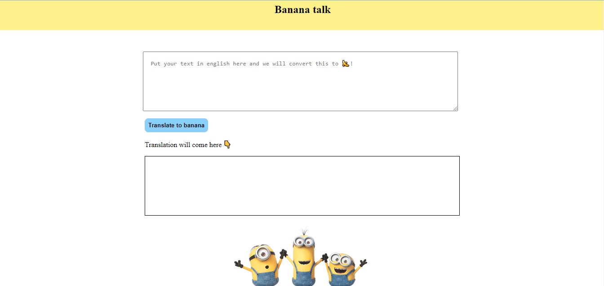

# "Minion speak app"

Tech stack:
This app is made using vanilla js.

About project:
This project was made as part of level zero of neogcamp.

"Minion speak app" takes input as text in english from user and translates it to minion language.

Used minion funtranslation api for the web app.

CLI app look:

